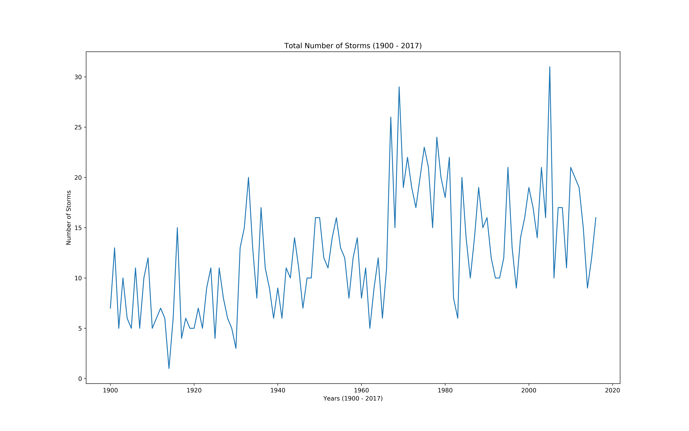
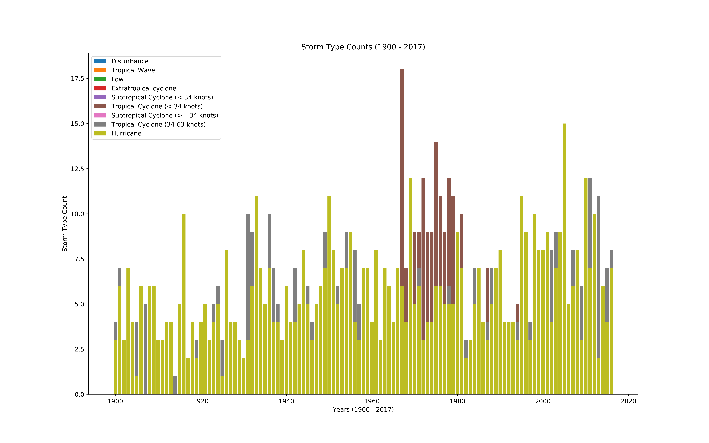

# weather-patterns
A little AWS lambda function for retrieving historical weather patterns, specifically related to tropical storms.

Data from: http://www.aoml.noaa.gov/hrd/hurdat/Data_Storm.html

## Setup
First, make sure you install everything from the **requirements.txt** file. Once that's done, you should be all set!

## Deployment
You'll want to setup an environment from which to run the lambda (with the necessary dependencies installed to their). Once that's done, you can then copy the environment (with the **lambda_function.py** script) to your lambda function, and it should run without issue!

## Sample Images

